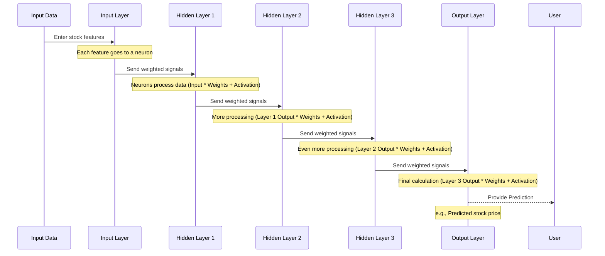

# Chapter 1: Neural Network Model

Welcome to the first chapter of the `stock-market-analysis` tutorial! We're going to start with one of the most exciting parts of this project: the **Neural Network Model**.

Think of a neural network like a computer program that's designed to learn, much like our own brains learn from experience. Our brains are made of many interconnected cells called neurons. Similarly, a neural network is made of artificial "neurons" organized in layers, all connected to each other.

In this project, we'll use a neural network to look at historical stock market data and try to find patterns or even predict future stock values. It's like teaching a computer to recognize signals in the market data that might hint at what will happen next.

### What is a Neural Network, Simply Put?

Imagine you're trying to decide if you should carry an umbrella today. You might consider a few things:

*   Is it cloudy?
*   Is the weather forecast predicting rain?
*   Is there a strong wind (which might blow rain away)?

Each of these is a piece of information. You weigh them in your head, and based on that, you make a decision (take the umbrella or not).

A neural network works in a similar way, but with numbers. It takes many pieces of numerical information (like stock prices, trading volume, etc.) and processes them through its artificial neurons to make a decision or prediction (like whether the stock price will go up or down, or what the future price might be).

### Key Parts of a Neural Network

Let's break down the core ideas:

1.  **Neurons:** These are the basic units. Each neuron receives some inputs, does a simple calculation, and passes the result on as an output.
2.  **Layers:** Neurons are grouped into layers.
    *   **Input Layer:** This is where your data (like today's stock price) enters the network. The number of neurons in this layer matches the number of input data points you give it.
    *   **Hidden Layers:** These are layers between the input and output. They process the information in complex ways, learning patterns in the data. Our network has three hidden layers!
    *   **Output Layer:** This is where the network gives its final answer or prediction (like the predicted stock price for tomorrow).
3.  **Connections (Weights):** Every neuron in one layer is connected to neurons in the next layer. These connections have "weights". Think of weights like the importance the network gives to a particular piece of information when making its calculation. These weights are what the network learns during training.
4.  **Activation Function:** After a neuron does its calculation (multiplying inputs by weights and summing them up), it passes the result through an "activation function". This function decides whether the neuron "fires" and passes a signal to the next layer, often introducing non-linearity, which helps the network learn complex patterns.

### How It Applies to Stock Analysis

In our project, the neural network takes various features from historical stock data (which we'll explore in later chapters like [Historical Stock Data](03_historical_stock_data_.md) and [Data Preprocessing (Scaling)](04_data_preprocessing__scaling__.md)). These features go into the **Input Layer**.

The information then travels through the **Hidden Layers**, where the network processes these features and learns relationships between them and past stock movements.

Finally, the **Output Layer** produces a prediction, which in our case is a value related to the future stock price or movement.

### Looking at the Code

Let's peek at some snippets from the `MLPnn.py` file to see how these concepts appear in code.

First, we define how many neurons are in our layers:

```python
# Neural Network Specifications
num_neurons_1 = 64    # First hidden layer
num_neurons_2 = 32    # Second hidden layer
num_neurons_3 = 16    # Third hidden layer
num_features = 50     # Input layer size (50 pieces of info)
```

This code simply sets up variables to define the size of each layer. We have 50 inputs (`num_features`), followed by three hidden layers with 64, 32, and 16 neurons respectively. The output layer will have 1 neuron (for our single prediction).

Next, the network needs the 'weights' for the connections between layers. These are represented as variables in the code that the network will update as it learns:

```python
import tensorflow as tf
import numpy as np # Used for data loading and types

# ... (data loading and hyperparameters are skipped for now) ...

# Define placeholders for input and output (These are like empty slots for data)
with tf.name_scope("inputs"):
    x = tf.placeholder(tf.float64, shape=[None, num_features], name="input_data") # Input data
    y = tf.placeholder(tf.float64, shape=[None, 1], name="output_labels")        # The correct answer for training

# ... (mlp_model function definition is skipped for now) ...

# Initialize weight variables
weights = {
    'h1': tf.Variable(tf.random_normal([num_features, num_neurons_1], dtype=np.float64)), # Weights from input to layer 1
    'h2': tf.Variable(tf.random_normal([num_neurons_1, num_neurons_2], dtype=np.float64)), # Weights from layer 1 to layer 2
    'h3': tf.Variable(tf.random_normal([num_neurons_2, num_neurons_3], dtype=np.float64)), # Weights from layer 2 to layer 3
    'out': tf.Variable(tf.random_normal([num_neurons_3, 1], dtype=np.float64))            # Weights from layer 3 to output
}
```

Here, `tf.Variable` creates the weights as numbers that TensorFlow can change during the learning process. `tf.random_normal` initializes them with small random values. `tf.placeholder` sets up where the actual input data (`x`) and the correct answer (`y`) will go when we run the network.

Finally, the `mlp_model` function defines the structure – how data flows through the layers:

```python
# Define the neural network architecture
def mlp_model(x, weights):
    with tf.name_scope("layers"):
        # Layer 1: Input multiplied by weights['h1'], then apply sigmoid activation
        layer1 = tf.nn.sigmoid(tf.matmul(x, weights['h1'])) 
        
        # Layer 2: Output of layer 1 multiplied by weights['h2'], then sigmoid
        layer2 = tf.nn.sigmoid(tf.matmul(layer1, weights['h2']))
        
        # Layer 3: Output of layer 2 multiplied by weights['h3'], then sigmoid
        layer3 = tf.nn.sigmoid(tf.matmul(layer2, weights['h3']))
        
        # Output Layer: Output of layer 3 multiplied by weights['out'], then sigmoid (final prediction)
        output_layer = tf.nn.sigmoid(tf.matmul(layer3, weights['out']))
        
    return output_layer

# Construct the model by calling the function
predictions = mlp_model(x, weights)
```

This code snippet shows the core "forward pass" of the network. Data `x` (the input) is multiplied by the first set of weights (`weights['h1']`), and the result goes through a `tf.nn.sigmoid` activation function. This result becomes the input for the next layer, and the process repeats through all hidden layers until it reaches the `output_layer`. The `sigmoid` function is a common activation function that squashes values between 0 and 1.

### How Data Flows (The Forward Pass)

Let's visualize the path the data takes when you feed it into the network:



This diagram shows the flow. Information starts at the Input Layer, gets processed through each Hidden Layer, and finally results in a prediction from the Output Layer. The calculations at each step involve multiplying the incoming signals by the `weights` connecting the layers and then applying the `activation function`.

The "learning" happens when the network adjusts these weights based on how far off its predictions are from the actual correct answers. We'll discuss how the network figures out how "wrong" it is and how it adjusts the weights in later chapters ([Loss Function](06_loss_function_.md) and [Optimizer](07_optimizer_.md)).

### Conclusion

In this chapter, we introduced the concept of a Neural Network as a powerful learning program inspired by the human brain. We saw how it's structured with layers of interconnected neurons and how it uses "weights" and "activation functions" to process information. We also got a first look at how this concept is represented in the project's code, defining the layers and the flow of data.

Understanding the neural network model is the first step. Before we can train it, we need to get the data it will learn from.

Let's move on to find out where our stock data comes from!

[Next Chapter: Stock Data Source](02_stock_data_source_.md)

---

<sub><sup>Generated by [AI Codebase Knowledge Builder](https://github.com/The-Pocket/Tutorial-Codebase-Knowledge).</sup></sub> <sub><sup>**References**: [[1]](https://github.com/vinaybembalge/stock-market-analysis/blob/e4709852d16f4299f40f0656326ffe6bc7e07b07/MLPnn.py), [[2]](https://github.com/vinaybembalge/stock-market-analysis/blob/e4709852d16f4299f40f0656326ffe6bc7e07b07/Untitled.ipynb)</sup></sub>
