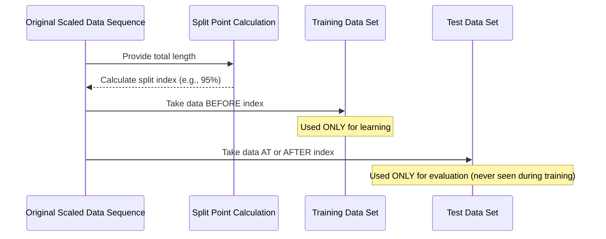

# Chapter 5: Training and Testing Split

Welcome back! In our last chapter, [Data Preprocessing (Scaling)](04_data_preprocessing__scaling__.md), we prepared our historical stock data by scaling it so all the numbers were within a nice, consistent range, making it easier for our [Neural Network Model](01_neural_network_model_.md) to learn.

Now that our data is clean and scaled, are we ready to feed *all* of it into the neural network for training? Not quite. There's one more crucial step before we begin training: splitting our data into two main groups.

Think of training a neural network like a student preparing for an exam. The student studies a bunch of practice questions (the training data). To see how well they *really* understand the material, you give them a final test with questions they haven't seen before (the test data). If they do well on the practice questions but poorly on the final test, they probably just memorized the answers instead of truly learning the concepts.

In machine learning, we do the same thing with our data. This is called the **Training and Testing Split**.

### Why Split the Data?

The main reason we split our data is to get an honest evaluation of how well our model will perform on *new, unseen* stock data in the future.

Here's why it's important:

1.  **Detecting Overfitting:** This is the biggest danger. Overfitting happens when a model learns the training data *too well*, including the random noise or specific quirks of that data. It becomes like a student who memorizes practice test answers. It will perform perfectly on the training data but fail miserably on any new data. By testing on data the model has *never* seen during training, we can see if it has truly learned the underlying patterns or just memorized the training set.
2.  **Reliable Performance Metric:** The performance we measure on the test set gives us a realistic idea of how the model will likely behave when we use it to make predictions on future, real-world stock data.
3.  **Guiding Model Improvement:** If the model performs poorly on the test set (even if it's great on the training set), it tells us we might need to adjust the model structure, gather more data, or change how we train it.

So, we take our entire dataset of historical stock prices and divide it:

*   **Training Set:** This is the larger portion of the data. The neural network uses *only* this data to learn patterns and adjust its internal connections ([Connections (Weights)](01_neural_network_model_.md)).
*   **Test Set:** This is a smaller portion of the data that the network *never* sees during training. After training is complete, we use the test set to evaluate the model's performance.

### How Do We Split the Data?

The most common way to split sequential data like stock prices is to take the earlier portion for training and the later portion for testing. This makes sense because we train models to predict future events based on past data. Testing on data from a later period is a more realistic simulation of predicting the future.

A typical split might be 70% for training and 30% for testing, or 80% for training and 20% for testing. The specific split percentage can be chosen based on the dataset size and desired balance between training examples and evaluation data.

Let's look at how this split is done in code, similar to how it's handled in the `Untitled.ipynb` notebook after the scaling step:

```python
import numpy as np
# Assume 'scaled_data' is the output from the MinMaxScaler
# It's a NumPy array of scaled stock prices like [[0.1], [0.15], [0.13], ...]

# Determine the size of the training data (e.g., 95% of the total data)
# The notebook uses 95%
total_data_len = len(scaled_data)
training_data_len = int(np.ceil(total_data_len * 0.95)) 

print(f"Total data points: {total_data_len}")
print(f"Training data length: {training_data_len}")
print(f"Testing data length: {total_data_len - training_data_len}")

# Split the data using array slicing
# The first part is training data
train_data = scaled_data[0:training_data_len, :] 

# The rest is test data
test_data = scaled_data[training_data_len:, :] 

print("\nShape of training data:", train_data.shape)
print("Shape of testing data:", test_data.shape)
```

This code calculates the index point where the split should occur (95% through the data). Then, it uses basic Python list/array slicing (`[start:end]`) to create two separate NumPy arrays: `train_data` and `test_data`. The `[:, :]` ensures we keep all columns if `scaled_data` had more than one.

The output would show the number of data points assigned to each set:

```
Total data points: 1000 # Example total
Training data length: 950
Testing data length: 50

Shape of training data: (950, 1)
Shape of testing data: (50, 1) # Assuming 1 feature (like 'Close' price)
```
*(The exact numbers will depend on the amount of historical data fetched)*

After this split, we would then prepare the training data (`train_data`) and testing data (`test_data`) into the specific input sequences (X) and target outputs (y) that the neural network expects. The key is that the data for the test set is kept completely separate and untouched during the training phase.

### Under the Hood: A Conceptual Split

Conceptually, splitting data for time-series forecasting is like cutting a long ribbon of data at a specific point.



The original sequence is simply divided based on the calculated index. The data before the index forms the training set, and the data at or after the index forms the test set.

### Connecting to the Project Code (`MLPnn.py`)

While the splitting *process* is demonstrated in the notebook, the main script (`MLPnn.py`) uses data that has **already been split and saved** into separate CSV files:

```python
import numpy as np

# Load dataset and split into training (66%) and test (33%) sets
# Note: These files were created by a previous data preparation step
filename = 'training_set.csv'
raw_data = open(filename, 'rt')
training_set = np.loadtxt(raw_data, delimiter=",")

filename = 'training_labels.csv'
raw_data = open(filename, 'rt')
training_labels = np.loadtxt(raw_data, delimiter=",")

filename = 'test_set.csv'
raw_data = open(filename, 'rt')
test_set = np.loadtxt(raw_data, delimiter=",")

filename = 'test_labels.csv'
raw_data = open(filename, 'rt')
test_labels = np.loadtxt(raw_data, delimiter=",")

print("Dataset successfully loaded.")
```

These lines show the result of the splitting process. The data was loaded from a [Stock Data Source](02_stock_data_source_.md), potentially preprocessed (like [Data Preprocessing (Scaling)](04_data_preprocessing__scaling__.md)), structured into inputs (features) and outputs (labels) for the neural network, and then split into training and testing sets before being saved into these four separate CSV files. The `MLPnn.py` script simply loads these pre-prepared files.

The `training_set` and `training_labels` arrays hold the data the model will learn from, while `test_set` and `test_labels` are reserved purely for checking its performance later, after the learning is finished.

### Conclusion

Splitting the historical data into distinct training and testing sets is a fundamental step in machine learning, especially for time-series data like stock prices. It's essential for realistically evaluating the performance of our [Neural Network Model](01_neural_network_model_.md) and ensuring it hasn't simply memorized the training data.

We've seen how this split is conceptually a simple division of the dataset and how the project's main script loads data that has already undergone this crucial step.

With our data now loaded, split, and ready, the next step is to understand how the neural network knows if it's making good or bad predictions during training, and how it learns to improve. This brings us to the concepts of the **Loss Function** and the **Optimizer**.

[Next Chapter: Loss Function](06_loss_function_.md)

---
