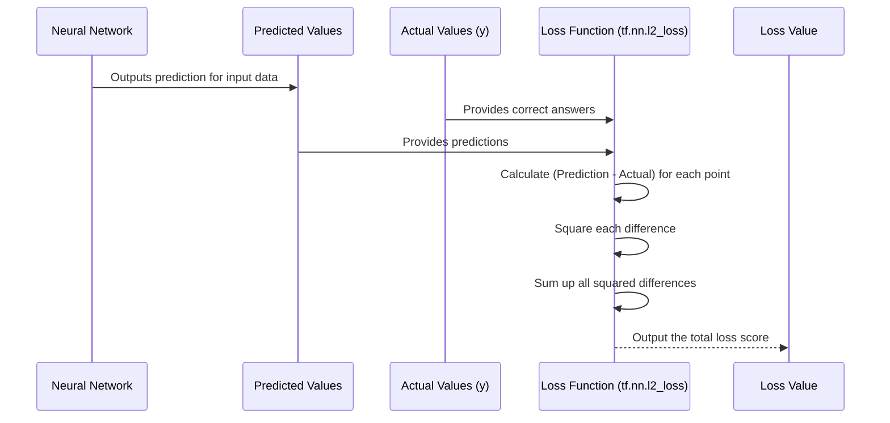

# Chapter 6: Loss Function

Welcome back! In the last chapter, we completed the crucial step of dividing our prepared historical stock data into a [Training and Testing Split](05_training_and_testing_split_.md). This gave us separate sets of data: one for the neural network to learn from, and one to evaluate how well it learned.

Now, imagine the neural network is like that student studying for the exam. After seeing a practice question (input data from the training set) and giving an answer (making a prediction), how does the student know if their answer was right or wrong? They compare it to the correct answer!

In the world of neural networks, this comparison is handled by something called the **Loss Function**.

### What is a Loss Function?

At its core, a Loss Function is a mathematical way to measure **how wrong** the neural network's prediction is compared to the actual correct answer.

Think of it as a "penalty score".

*   If the network predicts a stock price of $100 and the actual price was $100, the loss is 0 (no penalty, perfect prediction!).
*   If the network predicts $105 and the actual price was $100, there's a small difference, so the loss is a small positive number.
*   If the network predicts $200 and the actual price was $100, that's a huge difference, so the loss is a large positive number (a big penalty!).

The goal of training a neural network is always to make this **Loss Function value as small as possible**. A smaller loss means the model's predictions are closer to the actual values.

### How Does the Project Use a Loss Function?

In our stock market analysis project, the neural network is trying to predict a future stock price (or a related value) based on past data.

1.  We feed historical data (input features) into the [Neural Network Model](01_neural_network_model_.md).
2.  The network processes this data and produces a **prediction** (an output value).
3.  We compare this **prediction** to the **actual** correct value that the network was trying to predict for that specific piece of historical data (the "label" from our training set).
4.  The **Loss Function** calculates the difference and gives us a single number representing how large that error is.

For example, if the network processes data from Day 99 and predicts the scaled price for Day 100 is 0.75, but the actual scaled price for Day 100 was 0.76, the loss function calculates the error between 0.75 and 0.76.

The specific Loss Function used in our project is related to the **Mean Squared Error (MSE)**.

### Mean Squared Error (MSE) - Simply Put

MSE is a common way to measure the difference between predictions and actual values, especially for tasks where you are trying to predict a continuous number (like a price).

Here's the simple idea behind it:

1.  Calculate the **difference** between the predicted value and the actual value for each data point.
2.  **Square** each of these differences (this makes all the errors positive and penalizes larger errors more heavily).
3.  Calculate the **average** (mean) of these squared differences.

Let's say you have two predictions and their actual values:

*   Prediction 1: 0.75, Actual 1: 0.76 -> Difference: 0.75 - 0.76 = -0.01. Squared Difference: (-0.01) * (-0.01) = 0.0001
*   Prediction 2: 0.80, Actual 2: 0.70 -> Difference: 0.80 - 0.70 = 0.10. Squared Difference: (0.10) * (0.10) = 0.01

The Loss (using a form of MSE) for these two points would involve averaging 0.0001 and 0.01.

Squaring the error is important because it means that predicting $10 away from the actual price ($100 loss) is much worse than predicting $1 away ($1 loss). Squaring makes the $10 error become 100 (10^2), while the $1 error becomes just 1 (1^2). This strongly encourages the network to avoid making large mistakes.

### Looking at the Code (`MLPnn.py`)

In the `MLPnn.py` script, the Loss Function is defined using TensorFlow:

```python
import tensorflow as tf
# ... other imports and code ...

# Define placeholders for input and output (x and y)
# x is the input data (features), y is the correct output (labels)

# ... model definition (predictions = mlp_model(x, weights)) ...

# Define loss function and optimization method
with tf.name_scope("loss_function"):
    # Calculate the difference (predictions - y)
    # Square the differences and sum them up (L2 Loss)
    loss = tf.nn.l2_loss(predictions - y, name="mean_squared_error") 
    tf.summary.scalar("training_loss", loss) # For monitoring during training

# ... optimizer definition ...
```

This simple line `loss = tf.nn.l2_loss(predictions - y, name="mean_squared_error")` is where the loss is calculated.

*   `predictions` is the output from our [Neural Network Model](01_neural_network_model_.md) for a given batch of training data.
*   `y` is the actual correct output (the "label") for that same batch of data from our training set ([Training and Testing Split](05_training_and_testing_split_.md)).
*   `predictions - y` calculates the difference between each prediction and its corresponding actual value.
*   `tf.nn.l2_loss(...)` is a TensorFlow function that calculates the sum of the squares of the differences. This is equivalent to the numerator part of the Mean Squared Error formula (sum of squared differences) without explicitly dividing by the number of samples. In TensorFlow, the averaging part is often handled implicitly or explicitly later when calculating the overall loss metric for display or logging. For optimization purposes, minimizing the sum of squares is equivalent to minimizing the mean of squares, as the divisor is constant.

This `loss` value is the critical number that tells us, for the current set of inputs and the current state of the network's weights, how "wrong" its predictions are.

### Under the Hood: Calculating the Loss

When you run the training step, after the network makes predictions, the loss function immediately goes to work:



This loss value is then used by the next component in the training process – the Optimizer – to figure out how to adjust the network's weights to reduce this loss in the future.

### Conclusion

The Loss Function is a fundamental concept in training neural networks. It provides a clear, mathematical way to quantify the error between the model's predictions and the actual correct values. Our project uses a form of Mean Squared Error (specifically `tf.nn.l2_loss`) to calculate this penalty score.

By giving the network this score, we provide it with the feedback it needs to learn. The training process is essentially a continuous effort to adjust the network's internal parameters (the weights) to minimize this loss value.

But how does the network use this loss value to actually *change* its weights? That's the job of the Optimizer, which we'll explore in the next chapter!

[Next Chapter: Optimizer](07_optimizer_.md)

---
