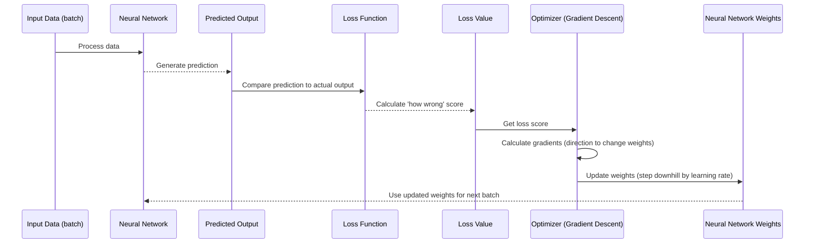

# Chapter 7: Optimizer

Welcome back! In the last chapter, [Loss Function](06_loss_function_.md), we learned how the neural network knows if its predictions are right or wrong. The Loss Function gives us a score – a single number that tells us "how wrong" the model is for a given set of predictions.

But knowing you're wrong isn't enough, right? You need to know *how* to improve! If a student gets a bad score on a test, they need a plan to study differently next time.

In our neural network project, the component that takes the "how wrong" score from the Loss Function and figures out "how to improve" is called the **Optimizer**.

### What is an Optimizer?

An Optimizer is an algorithm that guides the learning process of the neural network. It uses the feedback from the Loss Function to decide **how to change the network's internal settings** – specifically, its [Connections (Weights)](01_neural_network_model_.md).

Think of the training process like trying to find the lowest point in a valley while blindfolded.

*   The **Loss Function** tells you your current height (how "wrong" the model is).
*   The **Optimizer** is like a guide who tells you which way to step (which way to change the weights) to go *downhill* towards the lowest point (the minimum loss).

The goal of the Optimizer is to find the set of weights that makes the Loss Function value as low as possible, leading to the best possible predictions.

### How Does the Optimizer Work (Simply)?

1.  The neural network makes predictions.
2.  The [Loss Function](06_loss_function_.md) calculates the error (the "loss").
3.  The Optimizer looks at this loss and, using clever math (related to calculus, finding the "slope" of the loss relative to each weight), figures out which direction to nudge each weight to make the loss smaller. This "direction" is called the **gradient**.
4.  The Optimizer then updates each weight by a small amount in the downhill direction indicated by the gradient.
5.  Repeat steps 1-4 many, many times for different parts of the training data.

Over time, by repeatedly taking small steps in the direction that reduces the loss, the network's weights get better and better at making accurate predictions.

### Key Concepts

*   **Gradient:** Imagine the loss function as a hilly landscape where the height represents the loss. The gradient at any point tells you the direction of the *steepest ascent*. The Optimizer wants to go downhill, so it moves in the *opposite* direction of the gradient.
*   **Learning Rate:** This is a crucial setting for the Optimizer. It controls **how big** of a step the Optimizer takes in the downhill direction each time it updates the weights.
    *   A **large learning rate** means big steps. You might get to the bottom faster, but you could overshoot the lowest point or bounce around without settling.
    *   A **small learning rate** means tiny steps. You're less likely to miss the lowest point, but it will take much longer to get there.
    Finding the right learning rate is often key to successful training.

### Using the Optimizer in Our Project

In our `MLPnn.py` script, the Optimizer is defined using TensorFlow, specifically the `GradientDescentOptimizer`.

```python
import tensorflow as tf
# ... other imports and code ...

# Define loss function (calculated in the previous chapter)
# loss = tf.nn.l2_loss(predictions - y, name="mean_squared_error")

# Define optimizer
with tf.name_scope("optimizer"):
    # Use Gradient Descent
    # learning_rate was defined earlier (e.g., 0.01)
    optimizer = tf.train.GradientDescentOptimizer(learning_rate).minimize(loss)

# ... rest of the code (initialization, session, training loop) ...
```

This snippet shows the core part where the Optimizer is set up.

*   `tf.train.GradientDescentOptimizer(learning_rate)` creates an optimizer object that uses the Gradient Descent algorithm. We pass it the `learning_rate` we want it to use (how big the steps should be).
*   `.minimize(loss)` tells this optimizer *what* to minimize. It links the optimizer to the `loss` calculation we defined earlier. When we run the `optimizer` operation in our training loop, TensorFlow will automatically:
    1.  Calculate the loss.
    2.  Calculate the gradient (the "downhill direction") of the loss with respect to all the network's weights.
    3.  Update the weights by taking a step in the gradient's opposite direction, scaled by the learning rate.

### Under the Hood: The Optimization Step

Each time the neural network processes a batch of data during training, the following cycle happens:



This is one optimization step. The training loop repeats this step thousands or millions of times, gradually adjusting the weights to reduce the loss.

Gradient Descent is the simplest type of optimizer. More advanced optimizers (like Adam, RMSprop, etc.) use slightly different, often more sophisticated, methods to calculate the steps and adjust the learning rate, which can sometimes lead to faster or more stable training. However, the basic idea remains the same: use the loss to find the best way to change the weights to reduce the loss.

### Connecting to the Project Code (`MLPnn.py`)

The actual training loop in `MLPnn.py` puts the Loss Function and Optimizer together:

```python
# ... (optimizer defined as above) ...

# Begin training session
with tf.Session() as sess:
    # ... initialization and summary setup ...
    sess.run(init) # Initialize all variables (weights)
    print("Training process started.")

    # Training loop
    for epoch in range(num_epochs):
        # Get a batch of training data (input and labels)
        batch_x = training_set[batch_size * epoch:batch_size * (epoch + 1)]
        batch_y = training_labels[batch_size * epoch:batch_size * (epoch + 1)]
        batch_y = np.array(batch_y).reshape(len(batch_y), 1)

        # Run the optimizer and the loss calculation for this batch
        # The 'optimizer' operation includes the gradient calculation and weight update
        _, loss_value = sess.run([optimizer, loss], feed_dict={x: batch_x, y: batch_y})

        # Calculate average loss per sample for display
        avg_loss = loss_value / (batch_x.shape[0] + 0.01)

        # Display progress at intervals
        if epoch % log_interval == 0:
            print("Epoch:", '%05d' % (epoch), "Training loss:", "{:.9f}".format(avg_loss)) # Note: Printing loss, not accuracy directly here
        
        # ... summary writing ...
    
    print("Training complete!")
    # ... test evaluation ...
```

The key line is `_, loss_value = sess.run([optimizer, loss], feed_dict={x: batch_x, y: batch_y})`.

*   `sess.run(...)` is how we tell TensorFlow to execute parts of our graph (the network, loss, optimizer).
*   We are asking it to run two things: the `optimizer` operation and the `loss` calculation.
*   Running the `optimizer` operation is the core of the training step. It automatically triggers the calculation of gradients and the update of the weights based on the `learning_rate` and the current `loss`.
*   We also fetch the `loss_value` at the same time so we can print it and see how well the network is doing during training.

This loop continues for a set number of `num_epochs` (passes through the training data), with the Optimizer constantly working to tweak the weights to lower that `loss_value`.

### Conclusion

The Optimizer is the engine of the neural network's learning process. It takes the error signal provided by the [Loss Function](06_loss_function_.md) and calculates how to adjust the network's [Connections (Weights)](01_neural_network_model_.md) to reduce that error. Using algorithms like Gradient Descent, it iteratively updates the weights, taking steps scaled by the `learning_rate`, to find the optimal configuration for the model.

Understanding the Optimizer is crucial because it's the algorithm that actually performs the learning, guided by the feedback from the loss.

Now that we've covered all the individual components – the neural network structure, the data, how we prepare it, how we split it, how we measure errors, and how we use those errors to guide changes – we can finally put it all together and look at the complete **Model Training Process**.

[Next Chapter: Model Training Process](08_model_training_process_.md)

---
